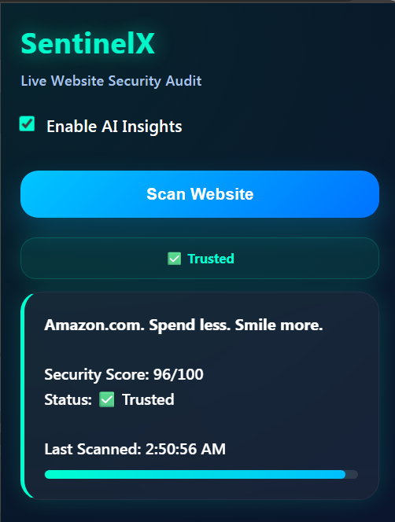
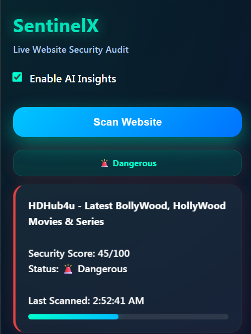
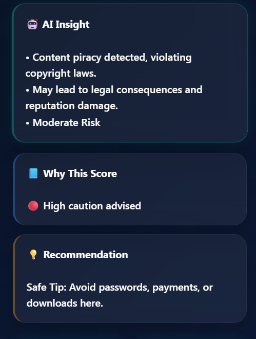
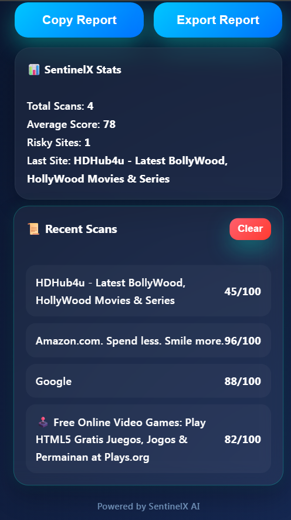

## Install SentinelX

1. Download this repository as ZIP
2. Extract files
3. Open Chrome:
chrome://extensions/  or "Manage extensions"
4. Enable Developer Mode
5. Click Load Unpacked
6. Select SentinelX folder

# SentinelX 🛡️

AI-powered Chrome extension that helps users detect risky websites before entering passwords, payments, or downloads.

### Real-time Website Safety Checks:
✅ Trust Score  
⚠️ Suspicious Domain Detection  
🚨 Unsafe HTTPS/Login Warnings  
🤖 Optional AI Insights

---

## Screenshots

### Trusted Website Scan

### Dangerous Website Scan

### AI implementation

### History

---

## Why SentinelX?

Many risky websites look normal.

SentinelX helps users make safer browsing decisions in seconds.

Use it before:

- Logging in
- Entering payment details
- Downloading files
- Visiting unknown websites
---

## Built With

- JavaScript
- Chrome Extension Manifest V3
- HTML/CSS
- Heuristic Risk Engine
- Optional AI Insights Backend
---

If you like this project, consider starring the repo ⭐
